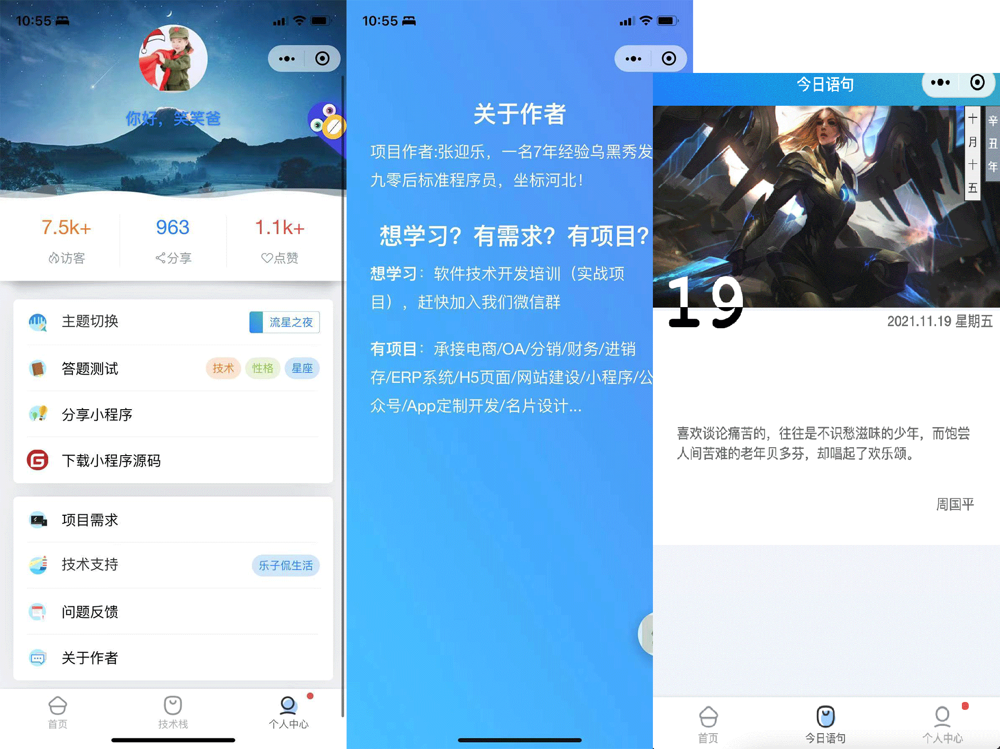

# Fix　乐子工具箱 开源学习小程序

基于uni-app、colorUi，支持小程序、H5、Android和IOS,搭建基础，拿来可用的小程序，方便各位开发小主学习借鉴！！！

```
🕙 项目基本保持每日更新，右上随手点个 🌟 Star 关注，这样才有持续下去的动力，谢谢～
```

### 扫码体验





### 项目说明

1.  项目灵感来源于 前端铺子 ，前台基于Vue-uniApp，使用colorUi与uview框架，部分Demo参考uniApp插件市场等，后台基于“若依”框架,感谢各位作者～

#### 特别声明
本软件属于技术开源软件, 任何使用本源码从事商业活动，对别人和自己造成损失的，本人概不负责！

#### 功能规划


#### 版本更新

##### 2021-11-13: 初始化项目
##### 2021-11-18: 增加定位功能 返查详细地址功能；增加油价查询


#### 安装教程

1.  下载安装：「HBuildX」、「微信开发者工具」
2.  扫码登录微信开发者工具
3.  将项目拖进【HBuildX】- 运行 - 微信小程序 - 完成


#### 作者信息

1.  作者：张迎乐 (Allan)
2.  邮箱：yingle1991@163.com
3.  微信：AllanJhon_ZYL
4.  博客：blog.rdtalk.cn(日常记录分享)
5.  公众号：乐子侃生活


#### 其他说明
> *  查看最新项目，请使用微信搜索小程序：“乐子工具箱”
> *  如果有不错的页面功能、设计\想法，大家都可以参与项目开发
> *  测试主页 ---后续更新

#### 关于后台
> *  目前使用 `「若依」` 制作的后台，感谢作者开源！
> *  已完成板块：首页banner、全网热搜词云，并且在持续制作中... 请关注项目。


### 交流群「Fix 乐子工具箱学习交流群」

<p>有想法或意见，大家加群可扫码进群</p>


</p>


#### 赞助作者


#### 有项目、设计、其他方面需求合作，可以联系QQ/公众号：
> *  183767076/乐子侃生活（请备注：合作/需求/设计/等）
